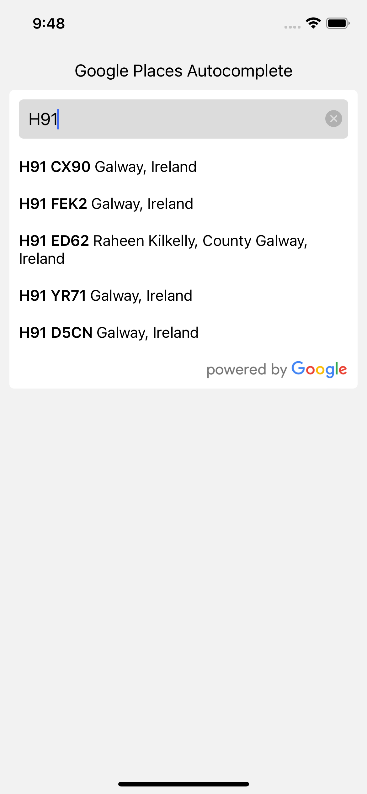

# expo-google-places-autocomplete

Google Places Autocomplete for React Native. This library uses the native Google Places SDK for iOS and Android.

## Preview



# Installation

```sh
npx expo install expo-google-places-autocomplete
```

For bare React Native projects, you must ensure that you have [installed and configured the `expo` package](https://docs.expo.dev/bare/installing-expo-modules/) before continuing.

## Configuration for iOS 🍏

> This is only required for usage in bare React Native apps.

Run `npx pod-install` after installing the npm package.

## Configuration for Android 🤖

No further steps are needed on Android

## Get your api key

Create a an API key [here](https://developers.google.com/maps/documentation/places/web-service/get-api-key/) and enable the "Places API". You must have billing enabled on the account.

## Usage

```ts
import { GooglePlacesAutocomplete } from "expo-google-places-autocomplete";

// ...
const onSearchError = React.useCallback((error: PlacesError) => {
  console.log(error);
}, []);

const onPlaceSelected = React.useCallback((place: PlaceDetails) => {
  console.log(place);
}, []);

<View>
  <GooglePlacesAutocomplete
    apiKey={API_KEY}
    requestConfig={{ countries: ["US"] }}
    onPlaceSelected={onPlaceSelected}
    onSearchError={onSearchError}
  />
</View>;
```

## Build your own

The library exposes three fucntions that you can use to build your own autocomplete component.

Start by initializing the SDK with your API key.

```ts
import PlacesAutocomplete from "expo-google-places-autocomplete";

// ...

useEffect(() => {
  PlacesAutocomplete.initPlaces(apiKey);
}, [apiKey]);
```

To get a list of predictions based on a users input you can attach an onChangeText handler to your TextInput and pass in your `RequestConfig` object. You will be returned an array of `Place` objects with at most 6 results.

```js
  // ...
  const [inputValue, setInputValue] = React.useState("");
  const [results, setResults] = React.useState<Place[]>([]);

  // ...
  const onChangeText = React.useCallback(
    async (text: string) => {
      try {
        let result = await PlacesAutocomplete.findPlaces(text, requestConfig);
        setResults(result.places);
        setInputValue(text);
      } catch (e) {
        console.log(e);
      }
    },
    [requestConfig],
  );
```

When an item is selected from your list of results you can get the `PlaceDetails` with the following

```ts
const onPlaceSelected = React.useCallback(
  async (placeId: string) => {
    try {
      const details = await PlacesAutocomplete.placeDetails(placeId);
      console.log(details);
    } catch (e) {
      console.log(e);
    }
  },
  [onPlaceSelected],
);
```

## Styling the provided component

| key                   | type      |
| --------------------- | --------- |
| containerStyle        | ViewStyle |
| searchInputStyle      | ViewStyle |
| inputContainerStyle   | ViewStyle |
| resultsContainerStyle | ViewStyle |
| resultItemStyle       | ViewStyle |
| listFooterStyle       | ViewStyle |

# Contributing

Contributions are welcome!
